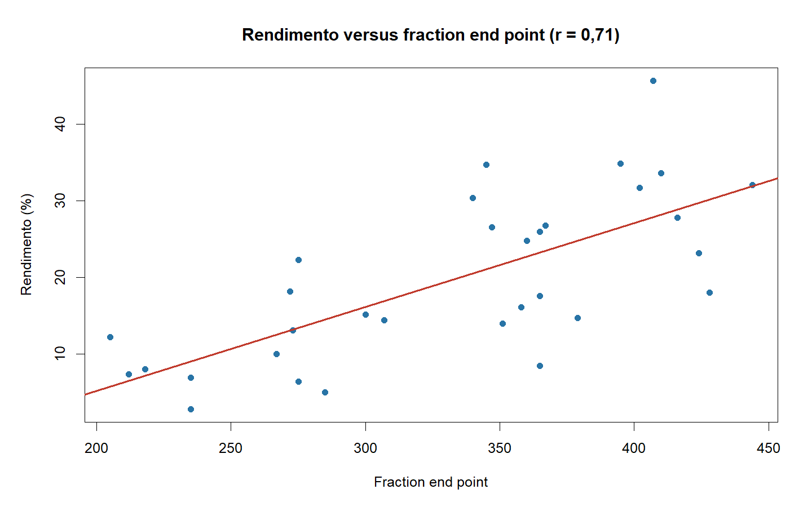
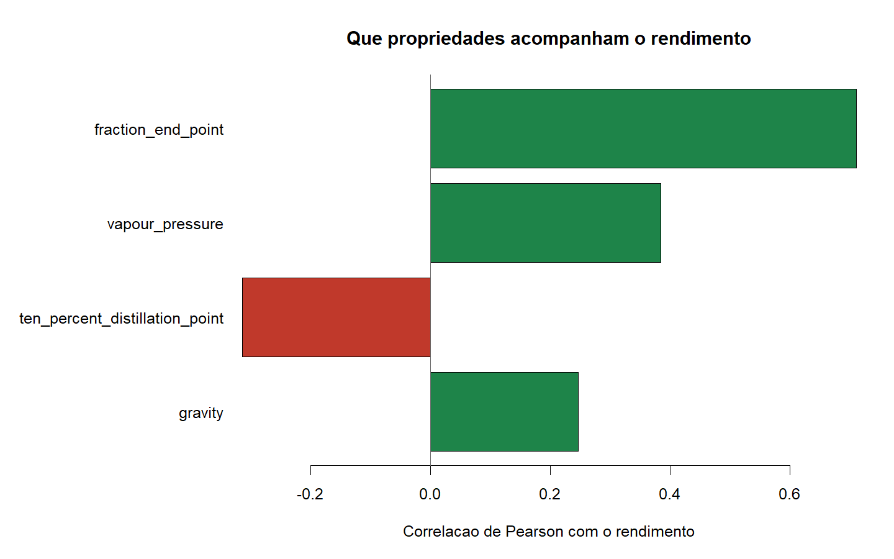
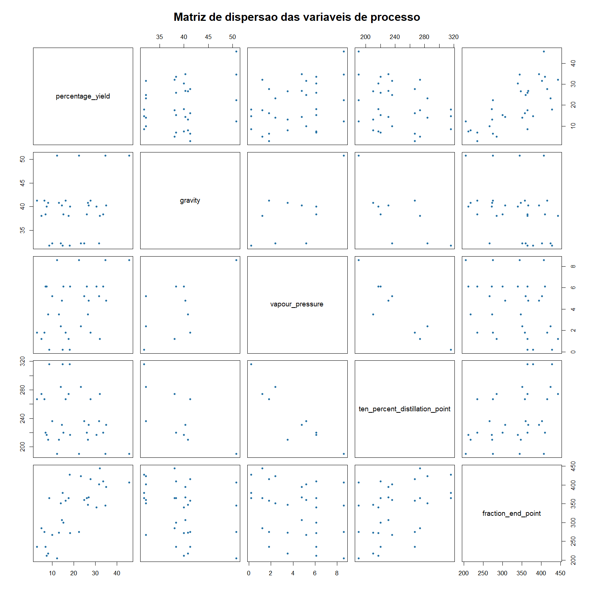

# Refinery Distillation Yield | Analysis in R

Reproducible analysis of **32 crude oil distillation batches**, relating four physicochemical
properties of the crude to the gasoline yield obtained.

It is deliberately the smallest project in the portfolio, and the most focused on a single
question: **what can and cannot be concluded from 32 observations.**

**Stack:** R 4.5.2 · base R only · no external dependencies

---

## Headline finding

> **Fraction end point tracks yield most closely (r = +0.71).** It is the temperature at which
> distillation stops — the higher it goes, the more fraction is recovered.



| Variable | Correlation with yield |
|---|---:|
| Fraction end point | **+0.712** |
| Vapour pressure | +0.384 |
| 10% distillation point | −0.315 |
| Gravity | +0.246 |



**Descriptive statistics of the process variables:**

| Variable | Mean | Median | SD | Min | Max |
|---|---:|---:|---:|---:|---:|
| Yield (%) | 19.66 | 17.80 | 10.72 | 2.8 | 45.7 |
| Gravity | 39.25 | 40.00 | 5.64 | 31.8 | 50.8 |
| Vapour pressure | 4.18 | 4.80 | 2.62 | 0.2 | 8.6 |
| 10% distillation point | 241.5 | 231.0 | 37.54 | 190 | 316 |
| Fraction end point | 332.1 | 349.0 | 69.76 | 205 | 444 |

Yield ranges from 2.8% to 45.7% — a 16x spread — which confirms there is real signal to explain
in this data.

## The actual story: the predictors are not independent

> **Vapour pressure and 10% distillation point correlate at −0.91.**
> They are not two variables; they are near enough the same information on different scales.

| Predictor pair | Correlation |
|---|---:|
| Vapour pressure x 10% distillation point | **−0.906** |
| Gravity x 10% distillation point | −0.700 |
| Gravity x Vapour pressure | **+0.621** |
| 10% distillation point x Fraction end point | +0.412 |
| Gravity x Fraction end point | −0.322 |
| Vapour pressure x Fraction end point | −0.298 |



Three of the four predictors are tightly bound to each other. In a multiple regression this
collinearity would make the coefficients unstable and individually uninterpretable: which variable
appeared "significant" would depend substantially on the order in which they entered. With
**32 observations for 4 predictors**, the problem worsens — the sample has nowhere near the
degrees of freedom to separate effects that overlap this much.

For that reason this project reports simple correlations and descriptive statistics, and **fits no
multiple model**. Calling that a limitation would be misleading: recognising what the sample
cannot support is the result itself.

## Method

1. **Import** — original CSV read from `01_DADOS_BRUTOS`, unchanged.
2. **Inspect** — dimensions, missing values and exact duplicates measured before cleaning.
3. **Clean** — column names normalised to snake_case.
4. **Transform** — type coercion, failing explicitly if any value is non-numeric.
   **No derived variables are created**, precisely to avoid inflating the predictor count against
   a sample of 32 observations.
5. **Validate** — quality record written to `07_TABELAS/validacao_limpeza.csv`.
6. **Analyse, plot and export** — including an explicit predictor collinearity table, in
   `07_TABELAS/predictor_multicollinearity.csv`.

**Data quality:** 32 rows to 32 rows · 0 missing values · 0 exact duplicates · 0 rows removed.

## Reproduce

```bash
Rscript 04_SCRIPTS_R/09_executar_pipeline.R
```

## Structure

```
01_DADOS_BRUTOS/    raw data, immutable
03_DADOS_LIMPOS/    cleaned data, pipeline output
04_SCRIPTS_R/       9 stages, one per file
05_NOTEBOOKS/       R Markdown notebook for Kaggle
06_GRAFICOS/        PNG charts
07_TABELAS/         result tables as CSV
09_DOCUMENTACAO/    data dictionary and dependencies
```

## Limitations

Thirty-two observations are few for any robust conclusion: at this sample size, the confidence
interval around a correlation of 0.71 runs roughly from 0.48 to 0.85, and a correlation of 0.25 is
indistinguishable from zero. The batches come from ten different crudes, introducing group
structure that this analysis does not model. Nothing here is causal: fraction end point is an
operating condition chosen by the operator, and it may well be chosen in response to crude
characteristics absent from the dataset.

## Data

Classic crude oil distillation dataset (Prater, 1956), widely republished in regression textbooks
and available on Kaggle. The original CSV sits unchanged in `01_DADOS_BRUTOS`.

## Licence

Code released under the MIT Licence (see `LICENSE`). The dataset keeps the terms of its original source.
